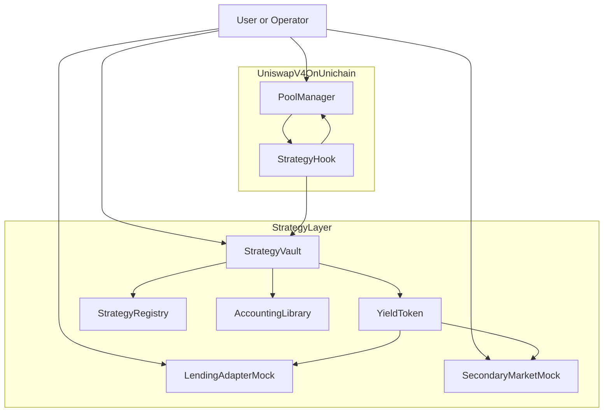
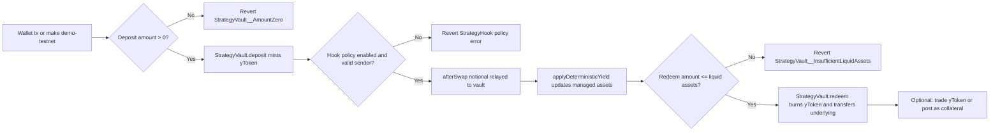
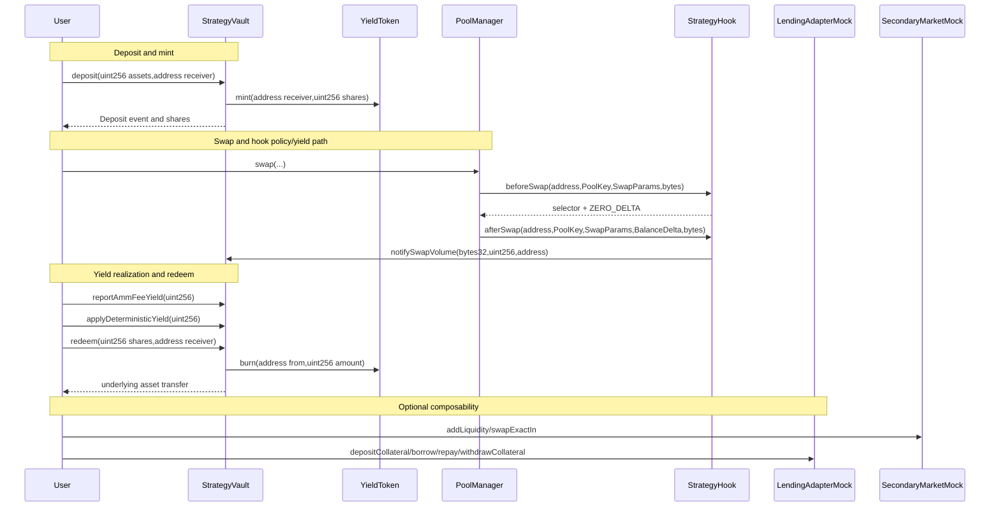

# Tokenized Strategies on Uniswap v4
**Built on Uniswap v4 · Deployed on Unichain Sepolia**
_Targeting: Uniswap Foundation Prize · Unichain Prize_

> Yield-bearing ERC20 strategy shares backed by Uniswap v4 liquidity with deterministic, hook-governed accounting on Unichain Sepolia.


-4A5CFF)

## The Problem
A lending market can accept wrapped LP assets as collateral, but if the LP side is a manually managed position, collateral quality collapses during volatile order flow. A user deposits capital, receives shares, and borrows against them; then flow conditions change, fee capture degrades, and there is no deterministic policy path at swap-time to constrain toxic order sizes. The direct capital impact is over-collateralization failure risk: borrowers extract value while share value drifts from expected strategy behavior.

The first failure layer is execution policy. In pre-hook AMM designs, policy is mostly exogenous to swap execution and delegated to off-chain operators. At the EVM level, there is no mandatory callback path that can enforce sender allowlists or max notional bounds before the swap state transition in the pool manager context. Consequence: LP strategy assumptions can be invalidated by flow that was never meant to be serviced under that strategy.

The second failure layer is accounting determinism. If vault shares are minted from raw token balance, donation-style skew changes apparent asset backing without changing strategy intent. At the EVM level, ERC20 transfers to a vault can occur without calling vault entrypoints, so balance-based pricing can be manipulated. Consequence: first-depositor and rounding edges become exploitable, and lending integrations cannot rely on stable share semantics.

The third failure layer is composability proof. A strategy token can exist, but without a deterministic, verifiable lifecycle from deposit to yield accrual to redemption and secondary trading, integrations treat it as opaque risk. At current DeFi TVL scale, even low-single-digit basis-point accounting drift translates to material liquidation and collateral-quality losses.

## The Solution
The core insight is to bind strategy policy enforcement and share accounting into one deterministic call chain: hook-observed swap flow updates pending strategy yield, and vault math converts that yield into auditable share-price growth.

At the user and operator level, a depositor sends underlying assets to `StrategyVault`, receives `YieldToken` shares, and can hold, trade, or post those shares as collateral. Yield enters in two deterministic channels: explicit AMM fee inflow via `reportAmmFeeYield(uint256)` and policy-linked deterministic yield via `notifySwapVolume(bytes32,uint256,address)` plus `applyDeterministicYield(uint256)`. The system guarantees that redemptions are bounded by liquid assets and that unsolicited token donations do not change share mint logic.

At the EVM/Solidity level, `StrategyHook` enables only `Hooks.BEFORE_SWAP_FLAG` and `Hooks.AFTER_SWAP_FLAG`, with `BaseHook` enforcing `onlyPoolManager` on hook entrypoints. `beforeSwap(address,PoolKey,SwapParams,bytes)` enforces pool policy and sender constraints; `afterSwap(address,PoolKey,SwapParams,BalanceDelta,bytes)` writes observed notional and notifies the vault. The vault keeps explicit state (`totalManagedAssets`, `lockedLiquidityAssets`, `rebateReserveAssets`, `pendingStrategyYield`) and uses `AccountingLibrary` with virtual shares/assets and directional rounding to preserve deterministic conversions.

INVARIANT: Swap policy must be enabled and bounded before execution — verified by `StrategyHook._beforeSwap()`

INVARIANT: Only configured hook can accrue strategy notional yield — verified by `StrategyVault.notifySwapVolume(bytes32,uint256,address)`

INVARIANT: Redeem cannot exceed liquid managed assets — verified by `StrategyVault.redeem(uint256,address)`

## Architecture

### Component Overview
```text
StrategySystem
  StrategyVault               - Custody/accounting core; deposit, redeem, yield accrual.
    YieldToken                - ERC20Permit share token; mint/burn restricted to vault.
    AccountingLibrary         - Conversion math, share price math, bps math.
  StrategyHook                - beforeSwap/afterSwap policy enforcement and notional relay.
  StrategyRegistry            - Strategy metadata and creator allowlist.
  LendingAdapterMock          - Demo collateral adapter over yToken.
  SecondaryMarketMock         - Demo constant-product yToken secondary pool.
  UniswapV4 PoolManager       - External hook caller and swap execution authority.
```

### Architecture Flow (Subgraphs)


### User Perspective Flow


### Interaction Sequence


## Core Contracts & Components

### StrategyVault
`StrategyVault` exists as the accounting and custody boundary for strategy assets. It separates user asset custody from swap policy logic so accounting correctness can be verified independently from hook execution paths. That separation is necessary because hook callbacks are externally triggered by `PoolManager`, while deposits and redemptions are user-triggered and require reentrancy-safe token movement.

Its critical functions are `function deposit(uint256 assets, address receiver) external returns (uint256 shares)`, `function redeem(uint256 shares, address receiver) external returns (uint256 assets)`, `function reportAmmFeeYield(uint256 assetsAdded) external`, `function fundRebateReserve(uint256 assetsAdded) external`, `function applyDeterministicYield(uint256 maxAmount) external returns (uint256 applied)`, `function notifySwapVolume(bytes32 poolId, uint256 notionalAmount, address sender) external`, and `function sharePrice() public view returns (uint256)`. The vault mints and burns share tokens through a dedicated `YieldToken` instance created in the constructor.

The vault owns `IERC20 public immutable asset`, `YieldToken public immutable yieldToken`, `address public hook`, `uint16 public immutable strategyRebateBps`, plus accounting state `totalManagedAssets`, `lockedLiquidityAssets`, `rebateReserveAssets`, and `pendingStrategyYield`. Trust boundaries are explicit: owner-only for `setHook` and liquidity lock configuration, hook-only for `notifySwapVolume`, and non-reentrant for state-changing token transfer flows. Unauthorized hook-callback attempts revert with `StrategyVault__OnlyHook`.

In the call stack, `StrategyVault` sits between user capital and composability endpoints. Upstream, it receives policy-derived notional data from `StrategyHook`; downstream, it updates `YieldToken` balances and provides share valuation for `LendingAdapterMock` via `previewRedeem(uint256)` semantics.

### StrategyHook
`StrategyHook` exists to enforce deterministic swap constraints at the only place that can guarantee pre/post swap enforcement for a Uniswap v4 pool: the pool-manager callback path. It is intentionally minimal, with swap-only permissions, so it constrains strategy-relevant behavior without carrying unrelated state.

It exposes owner configuration functions `function setVault(IStrategyVaultHookReceiver newVault) external`, `function setSenderAllowlist(address sender, bool allowed) external`, and `function setPoolPolicy(PoolKey calldata key, uint128 maxSwapAmount, bool enforceSenderAllowlist, bool enabled) external`. The hook execution surface is `BaseHook.beforeSwap(address,PoolKey,SwapParams,bytes)` and `BaseHook.afterSwap(address,PoolKey,SwapParams,BalanceDelta,bytes)`, implemented as `_beforeSwap` and `_afterSwap` overrides.

`StrategyHook` owns `IStrategyVaultHookReceiver public vault`, `mapping(PoolId => PoolPolicy) public poolPolicies`, `mapping(address => bool) public senderAllowlist`, and `mapping(PoolId => uint256) public observedNotionalByPool`. Unauthorized behavior is rejected with `StrategyHook__PolicyDisabled`, `StrategyHook__SenderNotAllowed`, and `StrategyHook__SwapAboveLimit`. Only owner can mutate policy configuration through `Ownable2Step`.

In the stack, the hook is called by `PoolManager`, validates and logs policy application, writes observed notional by pool, and relays notional to vault accounting. It does not transfer custody assets and does not mint/burn shares.

### YieldToken
`YieldToken` exists as a standard ERC20 share primitive that downstream protocols can integrate without custom decoding. It intentionally avoids rebasing and transfer hooks so integrations can treat balances as stable unit shares and source share-price changes from the vault rather than token-side supply mechanics.

Its critical functions are `function mint(address to, uint256 amount) external` and `function burn(address from, uint256 amount) external`, guarded by `onlyVault`, while permit support comes from `ERC20Permit` inherited behavior. The contract includes `function nonces(address owner) public view returns (uint256)` and EIP-2612 domain behavior through OpenZeppelin.

The token owns one significant state variable: `address public immutable vault`. Trust boundary is strict: any non-vault caller to `mint` or `burn` reverts with `YieldToken__OnlyVault`. In the stack, `YieldToken` is downstream of vault accounting and upstream of secondary-market and lending adapters as the transferable integration unit.

### StrategyRegistry
`StrategyRegistry` exists as metadata and creation-governance state, separate from vault accounting and hook execution. This keeps registration policy and discoverability concerns out of custody-critical contracts.

Critical functions are `function registerStrategy(bytes32 strategyId,address vault,address hook,address underlying,address yieldToken,uint24 poolFee,string calldata metadataURI) external`, `function updateStrategy(bytes32 strategyId, bool active, string calldata metadataURI) external`, `function getStrategy(bytes32 strategyId) external view returns (StrategyConfig memory)`, and `function setAllowedCreator(address account, bool allowed) external`. Registration guards prevent zero-address configs and duplicate strategy IDs.

Storage includes `mapping(bytes32 => StrategyConfig) private s_strategies` and `mapping(address => bool) public allowedCreators`. Unauthorized creator registration reverts with `StrategyRegistry__NotAllowedCreator`; missing strategy updates revert with `StrategyRegistry__NotFound`.

In the stack, `StrategyRegistry` is operational metadata adjacent to deploy/config scripts. It is not a custody or pricing dependency for mint/redeem correctness but is required for strategy discoverability and controlled publication.

### AccountingLibrary
`AccountingLibrary` exists to centralize share/asset conversion and avoid duplicated rounding logic across vault and adapters. It encodes rounding direction explicitly, which is necessary for predictable mint/redeem behavior under integer math.

Critical functions are `function toSharesDown(uint256 assets, uint256 totalAssets, uint256 totalShares) internal pure returns (uint256)`, `function toSharesUp(uint256 assets, uint256 totalAssets, uint256 totalShares) internal pure returns (uint256)`, `function toAssetsDown(uint256 shares, uint256 totalAssets, uint256 totalShares) internal pure returns (uint256)`, `function toAssetsUp(uint256 shares, uint256 totalAssets, uint256 totalShares) internal pure returns (uint256)`, `function sharePrice(uint256 totalAssets, uint256 totalShares) internal pure returns (uint256)`, and `function applyBps(uint256 amount, uint256 bps) internal pure returns (uint256)`.

The library defines `BPS_DENOMINATOR`, `PRICE_SCALE`, `VIRTUAL_ASSETS`, and `VIRTUAL_SHARES`. It has no caller trust boundary by itself, but contracts using it depend on its directional rounding assumptions to prevent share inflation from dust or donation edges.

In the stack, `StrategyVault` and `LendingAdapterMock` consume this math for mint/redeem previews and collateral borrow capacity, ensuring consistent conversion semantics across modules.

### LendingAdapterMock
`LendingAdapterMock` exists as a demo-only composability proof that yToken shares can back deterministic borrowing logic. It is intentionally minimal and chain-local, not presented as production lending integration.

Critical functions are `function depositCollateral(uint256 shares) external`, `function withdrawCollateral(uint256 shares) external`, `function borrow(uint256 amount) external`, `function repay(uint256 amount) external`, and `function maxBorrow(address user) external view returns (uint256 borrowCapacity)`. Borrowing is bounded by collateral factor over `vault.previewRedeem(collateralShares[user])`.

Storage includes `IERC20 public immutable collateralToken`, `IStrategyVaultViews public immutable vault`, `MockStable public immutable debtToken`, `uint16 public immutable collateralFactorBps`, plus `mapping(address => uint256) public collateralShares` and `mapping(address => uint256) public userDebt`. Over-borrow attempts revert with `LendingAdapterMock__BorrowTooHigh`.

In the stack, it consumes yToken balances and vault preview pricing without touching vault accounting internals. It proves collateral composability while preserving primary strategy correctness independent of this adapter.

### SecondaryMarketMock
`SecondaryMarketMock` exists as a demo-only secondary liquidity proof for yToken. It demonstrates that users can access strategy exposure through trading, not only through mint/redeem.

Critical functions are `function addLiquidity(uint256 amountA, uint256 amountB) external` and `function swapExactIn(address tokenIn, uint256 amountIn, uint256 minAmountOut) external returns (uint256 amountOut)`. The pool uses fixed 0.3% fee math (`amountInWithFee = amountIn * 997`) and reserve updates.

Storage includes `tokenA`, `tokenB`, `reserveA`, and `reserveB`. Invalid routes and slippage conditions revert with `SecondaryMarketMock__InvalidToken`, `SecondaryMarketMock__AmountZero`, and `SecondaryMarketMock__SlippageExceeded`.

In the stack, it consumes `YieldToken` as a market-tradable asset and provides external price discovery path for strategy shares independent of vault direct redemption.

### Data Flow
A canonical end-to-end flow starts when a user calls `StrategyVault.deposit(uint256,address)`, which transfers `asset`, increments `totalManagedAssets`, and calls `YieldToken.mint(address,uint256)`. During market activity, `PoolManager` calls `StrategyHook.beforeSwap(address,PoolKey,SwapParams,bytes)` for guard checks, then `StrategyHook.afterSwap(address,PoolKey,SwapParams,BalanceDelta,bytes)` which increments `observedNotionalByPool[poolId]` and calls `StrategyVault.notifySwapVolume(bytes32,uint256,address)`. The vault converts notional to pending yield via `AccountingLibrary.applyBps` and updates `pendingStrategyYield`. A caller then executes `StrategyVault.reportAmmFeeYield(uint256)` and/or `StrategyVault.applyDeterministicYield(uint256)`, which move value into `totalManagedAssets` from transfer-in and reserve-backed pending yield. Finally, user calls `StrategyVault.redeem(uint256,address)`, vault checks `maxWithdrawableAssets()`, burns shares via `YieldToken.burn(address,uint256)`, decrements `totalManagedAssets`, and transfers underlying. Optional side paths use the same shares: `SecondaryMarketMock.swapExactIn(address,uint256,uint256)` for trading and `LendingAdapterMock.depositCollateral/borrow/repay/withdrawCollateral` for collateral demonstration.

## Strategy Yield States

| State | Entry Condition | State Writes | Observable Effect |
|---|---|---|---|
| Initialized | Vault deployed, no deposits | `totalManagedAssets=0`, `totalSupply=0` | `sharePrice()` returns `1e18` |
| Deposited | `deposit(assets,receiver)` succeeds | `totalManagedAssets += assets`, `yieldToken.mint` | User receives yToken |
| AMM Yield Reported | `reportAmmFeeYield(assetsAdded)` succeeds | `totalManagedAssets += assetsAdded` | Share price increases |
| Pending Strategy Yield | Hook calls `notifySwapVolume` | `pendingStrategyYield += applyBps(notional,rebateBps)` | Claimable deterministic yield accumulates |
| Deterministic Yield Applied | `applyDeterministicYield(maxAmount)` succeeds | `pendingStrategyYield -= applied`, `rebateReserveAssets -= applied`, `totalManagedAssets += applied` | Share price increases |
| Redeemed | `redeem(shares,receiver)` succeeds | `yieldToken.burn`, `totalManagedAssets -= assets` | Underlying returned to user |

The non-obvious behavior is that reserve funding does not increase `totalManagedAssets` immediately; it only becomes strategy yield after explicit application. This preserves deterministic attribution and prevents reserve pre-loading from distorting share price.

## Deployed Contracts

### Unichain Sepolia (chainId 1301)

| Contract | Address |
|---|---|
| DemoERC20 Underlying | [0x86Cc97076b22273eA62a53A48396e800380E8Fd5](https://unichain-sepolia.blockscout.com/address/0x86Cc97076b22273eA62a53A48396e800380E8Fd5) |
| StrategyVault | [0x5dcd7261ca40a6c5f6e42c79d7f61049804bcfe6](https://unichain-sepolia.blockscout.com/address/0x5dcd7261ca40a6c5f6e42c79d7f61049804bcfe6) |
| YieldToken | [0x28D0e18D9da02D5D38D64272Cfe2a59dAC7BFb30](https://unichain-sepolia.blockscout.com/address/0x28D0e18D9da02D5D38D64272Cfe2a59dAC7BFb30) |
| StrategyHook | [0x7cc7f4337ea61ad037301f12f0acde77055d80c0](https://unichain-sepolia.blockscout.com/address/0x7cc7f4337ea61ad037301f12f0acde77055d80c0) |
| StrategyRegistry | [0xdcf9a1c30e89029b3848cbbeb98beb2dab51e521](https://unichain-sepolia.blockscout.com/address/0xdcf9a1c30e89029b3848cbbeb98beb2dab51e521) |
| LendingAdapterMock | [0x93b30829c38e40aa052d8c6b888b48e6b97f5530](https://unichain-sepolia.blockscout.com/address/0x93b30829c38e40aa052d8c6b888b48e6b97f5530) |
| SecondaryMarketMock | [0xfb0251065aafde388eb058b25ef5c7c96933f6ec](https://unichain-sepolia.blockscout.com/address/0xfb0251065aafde388eb058b25ef5c7c96933f6ec) |
| Uniswap v4 PoolManager (integration) | [0x00b036b58a818b1bc34d502d3fe730db729e62ac](https://unichain-sepolia.blockscout.com/address/0x00b036b58a818b1bc34d502d3fe730db729e62ac) |

## Live Demo Evidence
Demo run date: March 19, 2026 (Unichain Sepolia, chainId 1301).

### Phase 1 — Underlying Asset Bootstrap
This phase proves that the demo asset exists on-chain and is tied to the configured owner wallet before strategy deployment. The deployment transaction [0xa399417f9e56c92bede1e6013294ca59beda8f30eb88a888541639fb8e3e4ba0](https://unichain-sepolia.blockscout.com/tx/0xa399417f9e56c92bede1e6013294ca59beda8f30eb88a888541639fb8e3e4ba0) creates `DemoERC20`; verifiers should check contract creation trace and constructor args (`name`, `symbol`, `owner`) and confirm code at `UNDERLYING_ASSET`. This phase proves the base asset is reproducible and auditable.

### Phase 2 — Strategy System Deployment and Wiring
This phase proves deterministic deployment and module wiring. `StrategyVault` deploys in [0x2765502e4076d577e87a8176e2613996441b24901973b11bb1607ddf1882d41e](https://unichain-sepolia.blockscout.com/tx/0x2765502e4076d577e87a8176e2613996441b24901973b11bb1607ddf1882d41e), `StrategyHook` via CREATE2 in [0x65faca489735e2c89b7a7bbd6437679c61693e2c45d392060ad399e97a4ee7d3](https://unichain-sepolia.blockscout.com/tx/0x65faca489735e2c89b7a7bbd6437679c61693e2c45d392060ad399e97a4ee7d3), `StrategyRegistry` in [0x7b8ad9c769e86c2e86560b36ef0da3db1be725a47dc6d1520ee8f5078145c145](https://unichain-sepolia.blockscout.com/tx/0x7b8ad9c769e86c2e86560b36ef0da3db1be725a47dc6d1520ee8f5078145c145), `LendingAdapterMock` in [0x28f244dbc3d70ec7c2389bf865669e9d6e1b69d858fbbd7501360fdc4b676208](https://unichain-sepolia.blockscout.com/tx/0x28f244dbc3d70ec7c2389bf865669e9d6e1b69d858fbbd7501360fdc4b676208), and `SecondaryMarketMock` in [0x0396574690069a74334755b59d78c50b92426c54e73b337dd63248e4abdf3802](https://unichain-sepolia.blockscout.com/tx/0x0396574690069a74334755b59d78c50b92426c54e73b337dd63248e4abdf3802). Wiring and registration transactions are `vault.setHook` [0x54d56469f9e857eff3356e81e0b9140fb40c6037f68d09dcb7f0cd03d44698ec](https://unichain-sepolia.blockscout.com/tx/0x54d56469f9e857eff3356e81e0b9140fb40c6037f68d09dcb7f0cd03d44698ec), `registry.setAllowedCreator` [0x90febd6a61f9eb6243f13c023ebe3a5a8b25acd5db594f37531b6a26dea6fe17](https://unichain-sepolia.blockscout.com/tx/0x90febd6a61f9eb6243f13c023ebe3a5a8b25acd5db594f37531b6a26dea6fe17), and `registry.registerStrategy` [0x22691a5259bf54c6b2aca413f81904287c3fa280604fceae03e4cc1079dc2021](https://unichain-sepolia.blockscout.com/tx/0x22691a5259bf54c6b2aca413f81904287c3fa280604fceae03e4cc1079dc2021). Verifiers should confirm constructor code, owner assignments, and registry state updates. This phase proves deployment integrity and module connectivity.

### Phase 3 — User Lifecycle, Yield Accrual, Secondary Trading, and Collateral Flow
This phase proves the full product narrative. Approvals and deposit happen in [0x5da61c6106c9255e0125755baf1ae4869093f1f7d4584d81dc8b2674dafa659f](https://unichain-sepolia.blockscout.com/tx/0x5da61c6106c9255e0125755baf1ae4869093f1f7d4584d81dc8b2674dafa659f) and [0x98f943df41f75b7a8f6fc8e3fb29c61cedb12c22cc742dbf4ca094361378f227](https://unichain-sepolia.blockscout.com/tx/0x98f943df41f75b7a8f6fc8e3fb29c61cedb12c22cc742dbf4ca094361378f227), where `StrategyVault.deposit` emits `Deposit` and mints shares. AMM fee and deterministic-yield preparation occur in [0x6d28893c70764f47d6bdcc7ee3a71b1972c5c779baf0548a3c8047017f60c28c](https://unichain-sepolia.blockscout.com/tx/0x6d28893c70764f47d6bdcc7ee3a71b1972c5c779baf0548a3c8047017f60c28c), [0xf150d18d3053cc03925a5de58893d68fa13f974b70afa193049694c27ca985c8](https://unichain-sepolia.blockscout.com/tx/0xf150d18d3053cc03925a5de58893d68fa13f974b70afa193049694c27ca985c8), [0xc1386434bcf0ae8b2ee134e8a0d5c0b299f3fc80a9d2bd4a6d072c2996327e4f](https://unichain-sepolia.blockscout.com/tx/0xc1386434bcf0ae8b2ee134e8a0d5c0b299f3fc80a9d2bd4a6d072c2996327e4f), [0x7eecd667adf5e538df98002f7ac90d6254c3269972e3ee71a847ca6ea39b5f8a](https://unichain-sepolia.blockscout.com/tx/0x7eecd667adf5e538df98002f7ac90d6254c3269972e3ee71a847ca6ea39b5f8a), [0xea9305a786610bac7c7c7ba82805676f3a39aae18601578b8b6ad39eb35d418b](https://unichain-sepolia.blockscout.com/tx/0xea9305a786610bac7c7c7ba82805676f3a39aae18601578b8b6ad39eb35d418b), and [0xa90986c6b8a5d644cbc03caf8617178ebe8f3d7fd875fc093ca2d3fb0d3fed2c](https://unichain-sepolia.blockscout.com/tx/0xa90986c6b8a5d644cbc03caf8617178ebe8f3d7fd875fc093ca2d3fb0d3fed2c), where `AmmFeeYieldReported`, `RebateReserveFunded`, `StrategyYieldAccrued`, and `StrategyYieldApplied` can be checked. Secondary-market composability is proven by [0x0dc60a3bff32a37de44b3682d1a4c95bd05475e428df201c53b61e5cff1d670b](https://unichain-sepolia.blockscout.com/tx/0x0dc60a3bff32a37de44b3682d1a4c95bd05475e428df201c53b61e5cff1d670b), [0x644300eef0c4562312676d7843ec17b166a36e1aaed2414dff12f52751247da8](https://unichain-sepolia.blockscout.com/tx/0x644300eef0c4562312676d7843ec17b166a36e1aaed2414dff12f52751247da8), [0x3d60298b0112f0257e9dbda5be9c2b1bbd36b536040b76fe1813552966a3b12f](https://unichain-sepolia.blockscout.com/tx/0x3d60298b0112f0257e9dbda5be9c2b1bbd36b536040b76fe1813552966a3b12f), and [0xf542107a085dc55954f5c0eae5da8be93db1b01651c46f115a825ce5610b30c9](https://unichain-sepolia.blockscout.com/tx/0xf542107a085dc55954f5c0eae5da8be93db1b01651c46f115a825ce5610b30c9), where `LiquidityAdded` and `SwapExecuted` are emitted. Lending composability is proven by [0xadc5eff4d6fb5337fd7727a84a4ff0d29f36f0fa5cd3ad6777e682d521a30b91](https://unichain-sepolia.blockscout.com/tx/0xadc5eff4d6fb5337fd7727a84a4ff0d29f36f0fa5cd3ad6777e682d521a30b91), [0x86fe10b82481f44a9d670eb269f33f686fe6287188d19bd6856e616cfcb1968e](https://unichain-sepolia.blockscout.com/tx/0x86fe10b82481f44a9d670eb269f33f686fe6287188d19bd6856e616cfcb1968e), [0x0df62b2d39387d1162e2f157534ceb68fc035e45a00b6143488935fe33f82406](https://unichain-sepolia.blockscout.com/tx/0x0df62b2d39387d1162e2f157534ceb68fc035e45a00b6143488935fe33f82406), [0x1c4855a48abe6bb81fb8a4ed2348db1a0f865e53f3b66e3656dbf859235e3d55](https://unichain-sepolia.blockscout.com/tx/0x1c4855a48abe6bb81fb8a4ed2348db1a0f865e53f3b66e3656dbf859235e3d55), [0xccdae6f95a6cf9309196ab8b80a53703311e1be182b3e8b89c7dbee5e8674bb7](https://unichain-sepolia.blockscout.com/tx/0xccdae6f95a6cf9309196ab8b80a53703311e1be182b3e8b89c7dbee5e8674bb7), and [0x6e26fb248aead8929dbf8388378960215d9354d2bd04d3aabcdc779143293af8](https://unichain-sepolia.blockscout.com/tx/0x6e26fb248aead8929dbf8388378960215d9354d2bd04d3aabcdc779143293af8) through collateral and debt state transitions. Final redemption in [0x0a8025ea18ed9baa540d5084631791411efbff86559ca96704bb47e38ad38592](https://unichain-sepolia.blockscout.com/tx/0x0a8025ea18ed9baa540d5084631791411efbff86559ca96704bb47e38ad38592) burns shares and returns underlying, proving complete lifecycle closure.

Across all phases, the proof chain demonstrates a verifiable on-chain record for deployment integrity, deterministic yield accrual, composable share utility, and bounded redemption safety.

## Running the Demo
```bash
# run complete Unichain Sepolia demo (deploy missing parts or reuse existing)
make demo-testnet
# run bundled local demo sequence
make demo-all
```

```bash
# run yield lifecycle phase
make demo-yield
# run secondary market phase
make demo-secondary
# run testnet lifecycle with detailed tx logs
make demo-testnet
```

```bash
# run local end-to-end proofs in forge test harness
make demo-local
```

## Test Coverage
```text
Core contracts lines: 100.00% (163/163)
Core contracts branches: 100.00% (26/26)
Core contracts functions: 100.00% (35/35)
All src aggregate (including demo mocks): lines 98.44%, branches 100.00%, functions 96.08%
```

```bash
# enforce core-contract coverage gate
bash scripts/check_coverage.sh
```

- `unit`: Function-level behavior and revert-path validation across vault/hook/registry/token.
- `edge-case`: Donation attack, dust minting boundary, liquidity-constrained redeem, policy mismatch.
- `fuzz`: Round-trip and accounting consistency properties under bounded random inputs.
- `integration`: End-to-end lifecycle tests through hook, vault, swap, secondary, and lending flows.
- `economic`: Share-price growth and collateral-capacity behavior under deterministic yield sources.

## Repository Structure
```text
.
├── src/
├── scripts/
├── test/
└── docs/
```

## Documentation Index

| Doc | Description |
|---|---|
| `docs/overview.md` | System objective and lifecycle summary. |
| `docs/architecture.md` | High-level module graph and interaction map. |
| `docs/strategy-model.md` | Yield model, share price formula, and rounding behavior. |
| `docs/token-model.md` | Share-token semantics and integration assumptions. |
| `docs/security.md` | Attack surfaces, mitigations, and residual risks. |
| `docs/deployment.md` | Environment and deployment workflow notes. |
| `docs/demo.md` | Demo phases and proof outputs expected by judges. |
| `docs/api.md` | Primary external methods per contract. |
| `docs/testing.md` | Test commands and suite composition. |

## Key Design Decisions
**Why separate hook policy from vault accounting?**  
`StrategyHook` handles swap-time constraints while `StrategyVault` handles custody and pricing state. This split reduces blast radius and keeps pricing logic auditable without requiring pool-manager context in every accounting path.

**Why managed-assets accounting instead of raw token balance pricing?**  
Raw balance can be changed by unsolicited transfers, which creates donation skew. Using `totalManagedAssets` updated only by controlled entrypoints prevents donation-driven share inflation and stabilizes integration assumptions.

**Why reserve-backed deterministic yield application?**  
The system records pending strategy yield from observed notional, then applies it only up to funded reserve. That explicit two-step model avoids implicit minting, gives bounded attribution, and keeps share-price changes explainable transaction by transaction.

**Why keep demo composability adapters as mocks?**  
`LendingAdapterMock` and `SecondaryMarketMock` prove interface-level composability without claiming production integration. This keeps security scope explicit while still demonstrating collateral and secondary-liquidity narratives for judges.

## Roadmap
- [x] Unichain Sepolia deployment and deterministic tx proof chain
- [x] Core hook/vault/token/registry implementation
- [x] Unit, fuzz, and integration suite with CI gating
- [x] Demo script with detailed tx links and lifecycle summary
- [ ] Replace mock secondary pool with native Uniswap v4 yToken market route
- [ ] Add dedicated invariant-test contracts and invariant CI target
- [ ] Add multisig ownership and timelocked admin controls
- [ ] Integrate production lending adapter after protocol-specific review

## License
MIT
