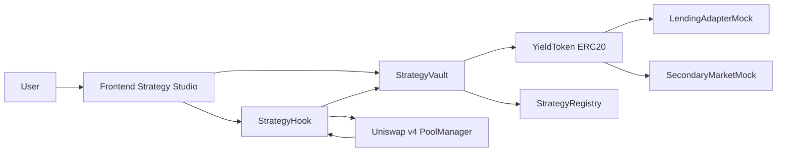
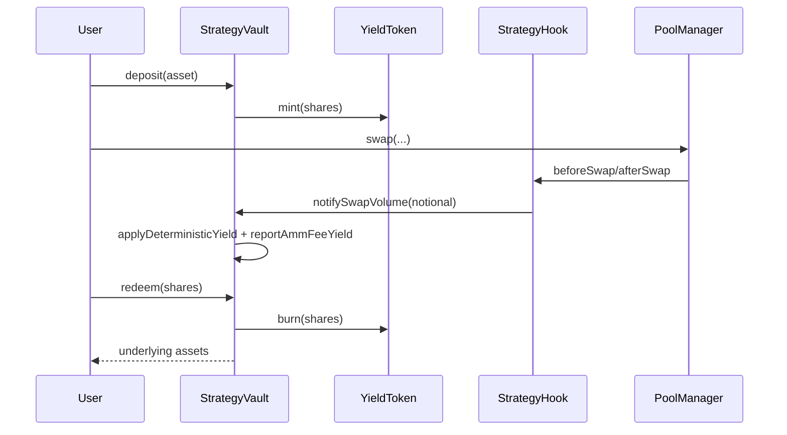

# Tokenized Strategies on Uniswap v4


Yield-bearing ERC20 strategy shares backed by Uniswap v4 liquidity, with deterministic accounting and hook-enforced execution policy.

## Problem
LP positions are productive but operationally heavy and not directly composable as lending collateral.

## Solution
This repo packages a strategy into a vault + hook system:
- `StrategyVault` mints ERC20 shares (`YieldToken`) on deposit.
- `StrategyHook` enforces deterministic swap-time policy and reports notional flow.
- Share price grows from two deterministic sources:
1. AMM fee yield (reported into managed assets).
2. Strategy rebate yield (swap-notional based, funded from reserve, permissionless apply).

## Architecture




## Repo Layout
- `src/` contracts
- `test/` unit + edge + fuzz + integration tests
- `script/` foundry scripts
- `frontend/` Strategy Studio
- `shared/abis/` shared ABIs
- `docs/` extended documentation
- `assets/` integration visuals
- `scripts/` bootstrap and verification helpers

## Quickstart
```bash
bash scripts/bootstrap.sh
forge test
npm install
npm --workspace frontend run dev
```

## Demo Commands
```bash
make demo-local
make demo-yield
make demo-secondary
make demo-testnet
make demo-all
```

`demo-local` output includes:
- deposit amount
- shares minted
- share price before/after
- redeem amount
- secondary trade confirmation

## Deployment
- Local Anvil: `forge script script/10_DeployStrategySystem.s.sol:DeployStrategySystemScript --rpc-url http://127.0.0.1:8545 --broadcast`
- Testnet (Base Sepolia preferred): set `.env`, then run `make demo-testnet`

If explorer URL is unknown for a chain, output is marked `TBD` and raw tx hashes are printed.

## Security Notes
- Hook entrypoints are restricted by `onlyPoolManager`.
- Vault mint/redeem paths are non-reentrant.
- Donation attacks are mitigated via managed-assets accounting.
- Liquidity lock bounds enforce safe redemptions.

See `SECURITY.md` and `docs/security.md`.

## Docs Index
- [docs/overview.md](docs/overview.md)
- [docs/architecture.md](docs/architecture.md)
- [docs/strategy-model.md](docs/strategy-model.md)
- [docs/token-model.md](docs/token-model.md)
- [docs/security.md](docs/security.md)
- [docs/deployment.md](docs/deployment.md)
- [docs/demo.md](docs/demo.md)
- [docs/api.md](docs/api.md)
- [docs/testing.md](docs/testing.md)
- [docs/frontend.md](docs/frontend.md)

## Assumptions
- Final commit-count requirement in prompt conflict (`300` vs `78`) resolved by honoring the last explicit instruction (`78`).
- `3779387` is treated as the pinned Uniswap v4 periphery commit; corresponding `v4-core` commit is pinned to that revision's submodule (`59d3ecf53afa9264a16bba0e38f4c5d2231f80bc`).

## Production Reminder
Before mainnet deployment, run a full external audit and formal economic review.
