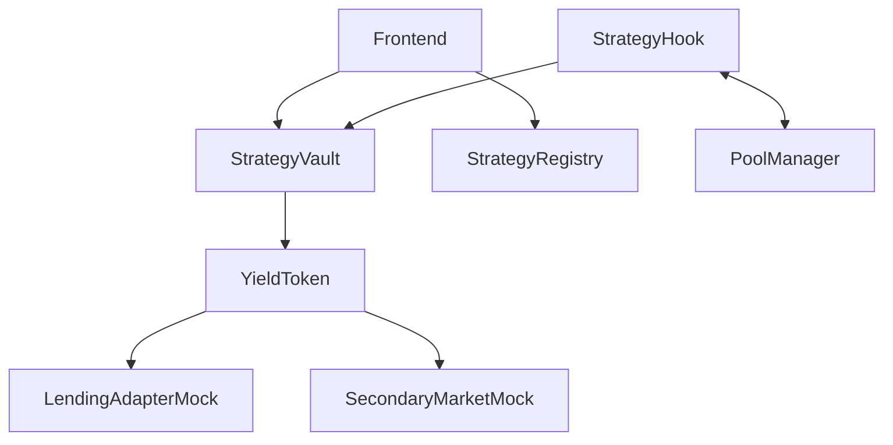

# Architecture

```mermaid
flowchart TD
  FE[Frontend] --> V[StrategyVault]
  FE --> R[StrategyRegistry]
  V --> Y[YieldToken]
  H[StrategyHook] <--> PM[PoolManager]
  H --> V
  Y --> L[LendingAdapterMock]
  Y --> S[SecondaryMarketMock]
```

Hook policy is deterministic and minimal: swap notional bounds + optional sender allowlist.
