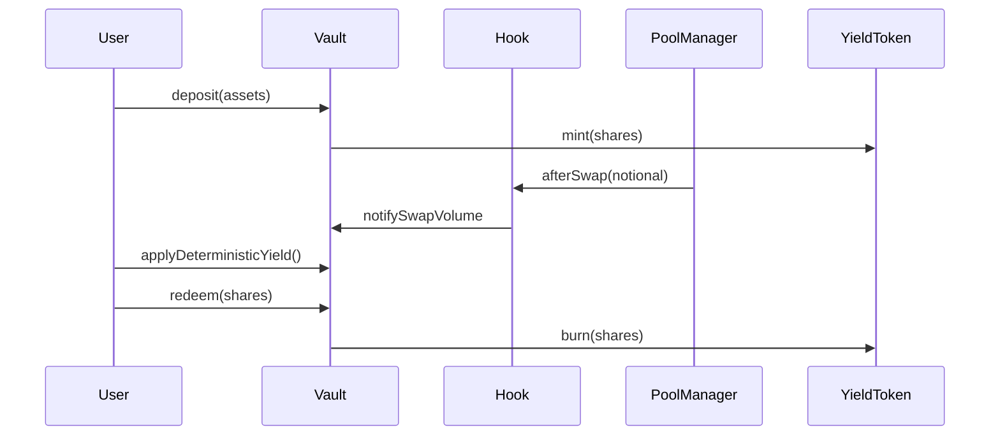

# Architectural Spec: Tokenized Strategies on Uniswap v4

## Objective
Represent a Uniswap v4 liquidity strategy as a transferable yield-bearing ERC20 (`YieldToken`) with deterministic accounting and policy-constrained execution.

## Components
- `StrategyVault`: custody, accounting, mint/redeem.
- `YieldToken`: ERC20 share token with permit support.
- `StrategyHook`: before/after swap policy enforcement and deterministic notional reporting.
- `StrategyRegistry`: strategy metadata and allowlist registry.
- `AccountingLibrary`: rounding-safe share/asset conversion.
- `LendingAdapterMock` (demo): yToken collateralization.
- `SecondaryMarketMock` (demo): yToken secondary tradability.

## Yield Sources
1. AMM fee yield: explicit inflow into managed assets (`reportAmmFeeYield`).
2. Strategy rebate yield: swap notional reported by hook, applied from funded reserve (`applyDeterministicYield`).

## Share Price
- `sharePrice = totalManagedAssets / totalSupply` (scaled 1e18)
- Managed assets are deterministic and exclude unsolicited token donations.

## Safety Invariants
- Hook entrypoints callable only by PoolManager.
- Vault redemptions bounded by `maxWithdrawableAssets`.
- Non-reentrancy on mint/redeem + external transfer paths.
- Rebate yield cannot exceed funded reserve.
- Redemptions cannot exceed available liquid assets.

## Lifecycle

## Dependency Strategy
- Single Foundry dependency graph under `lib/`.
- Pinned Uniswap dependency baseline with bootstrap enforcement.
- Single frontend lockfile (`package-lock.json`) for deterministic JS installs.

## Threats & Mitigations
- Share inflation/donation skew: accounting uses managed assets, not raw balance.
- Unauthorized hook execution: enforced by BaseHook `onlyPoolManager`.
- Redemption starvation: explicit locked-liquidity bound.
- Admin misconfiguration: owner-scoped functions documented; transfer to multisig recommended.

## Residual Risks
- Demo adapters are intentionally simplified and not production lending integrations.
- AMM fee realization path is implementation-dependent in production deployments.
